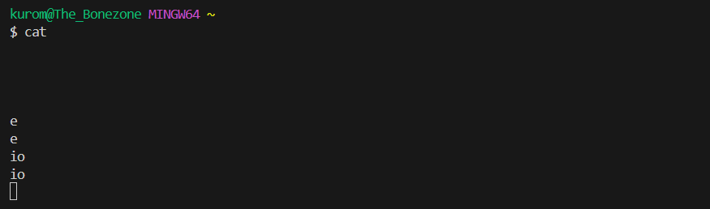
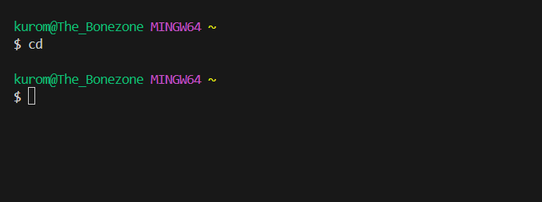
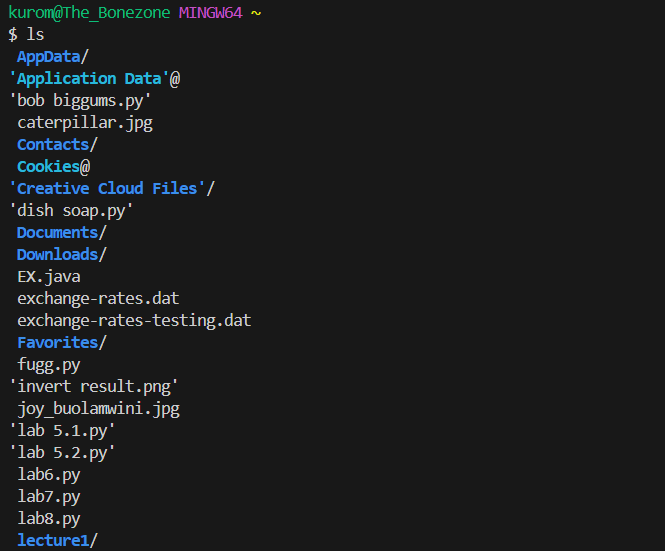
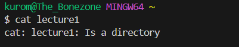
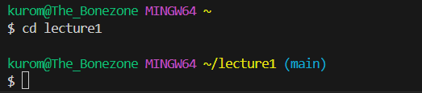
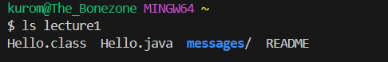
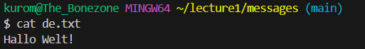
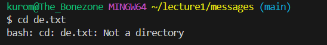
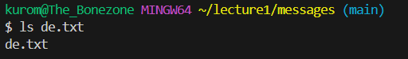

# CSE 15L Lab Report 1
## Empty Commands
Empty `cat` Command
***

* Absolute directory was /c/Users/kurom
* There was nothing to join with the `cat` command hence why the output comes out completely blank. Yet, it's also why the terminal doesn't just return a new command, seeing as pressing 'enter' on a blank space outputs another blank space, entering 'e' returns another 'e', etc.
* No, I don't think this is necessarily an error. Not what we want, but not an error either.

Empty `cd` Command
***

* Absolute directory was /c/Users/kurom
* Without an argument, your output is just the home directory as that's where you already start off. You're basically just changing directory to nowhere.
* Not an error.

Empty `ls` Command
***

* Absolute directory was /c/Users/kurom
* Since the `ls` command lists out contents, these are what appear on the output since these are contents inside the home directory.
* Not an error.

## Directory Commands
Directory `cat` Command
***

Directory `cd` Command
***

Directory `ls` Command
***

## File Commands
File `cat` Command
***

File `cd` Command
***

File `ls` Command
***

