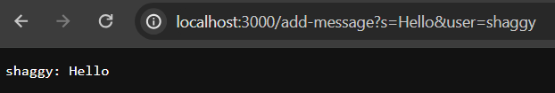
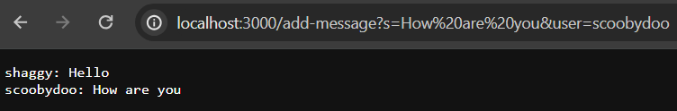
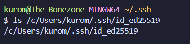
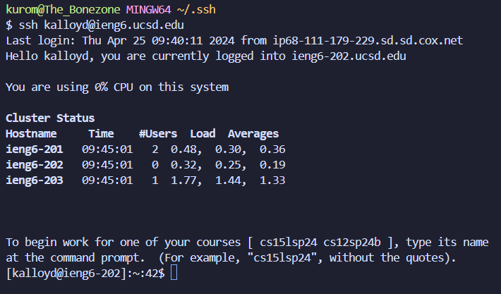

# Lab Report 2
## Part 1

```
import java.io.IOException;
import java.net.URI;

class ChatHandler implements URLHandler {
    // The one bit of state on the server: a number that will be manipulated by
    // various requests.

    String history = "";

    public String handleRequest(URI url) {
        if (url.getPath().equals("/")) {
            return String.format(history);
        }
        else {
            if (url.getPath().equals("/add-message")) {
                String[] parameters = url.getQuery().split("&");
                System.out.println(parameters[0] + " : " + parameters[1]);

                String[] message = parameters[0].split("=");
                String[] user = parameters[1].split("=");
                
                if ((message[0].equals("s")) && (user[0].equals("user"))) {
                    
                    history += user[1] + ": " + message[1] + "\n";

                    return String.format(history);
                
                }
            }
        }
        return "404 Not Found!";
    }
}


class ChatServer {
    public static void main(String[] args) throws IOException {
        if(args.length == 0){
            System.out.println("Missing port number! Try any number between 1024 to 49151");
            return;
        }

        int port = Integer.parseInt(args[0]);

        Server.start(port, new ChatHandler());
    }
}
```


* The method `urlgetpath.equals(/add-message)` is first called, which from there prompts the methods `url.getQuery().split("=")`, `parameters[0].split("=")`, `parameters[1].split("=")`. Finally, provided there is a legitimate message and user string within the parameters via `message[0].equals("s")` and `user[0].equals("user")`, the method `String.format(history)` is called to print the actual message.
* Respectively, the relevant arguments are the URL path `/add-message`, and URL query fragments `=`, `s`, and `user` in String form. The values of relevant fields are `""` for the String field `history` and `new URI("http://localhost:3000/add-message?s=Hello&user=shaggy)` for the URI url parameter in the `handleRequest()` method.
* By the end of the request, the String field `history` is updated to include the new "Hello" message.

---

* Much like above, the method `urlgetpath.equals(/add-message)` is called, which from there still prompts the methods `url.getQuery().split("=")`, `parameters[0].split("=")`, `parameters[1].split("=")`. Provided there is still a legitimate message and user string within the parameters via `message[0].equals("s")` and `user[0].equals("user")`, the method `String.format(history)` is called to print the actual message.
* Also respectively, the relevant arguments are the URL path `/add-message`, and URL query fragments `=`, `s`, and `user` in String form. The values of relevant fields are `"shaggy: Hello"` for the String field `history`, given how this updated after the last request, and `new URI(http://localhost:3000/add-message?s=How%20are%20you&user=scoobydoo)` for the URI url parameter in the `handleRequest()` method.
* As above, by the end of the request, `history` is updated to include the new "How are you" message. However, since it's kept track of previous messages, it appears below the "Hello" message on a new line.

## Part 2



## Part 3
In order to run a server from your terminal, you need to compile the java files using the `javac` command with the relevant java files or just simply `*.java` for all. From there, you run the `java` command with the name of the desired server with any random port number. If the commands are written correctly and if the port number is valid, the server runs and localhost site is available to view.
