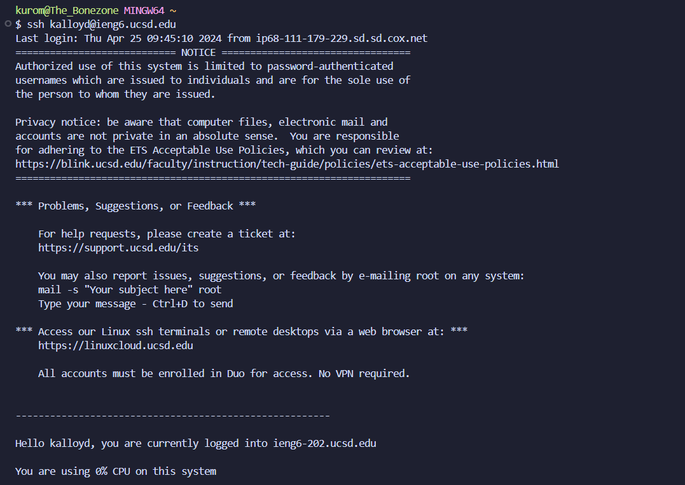
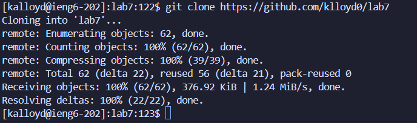
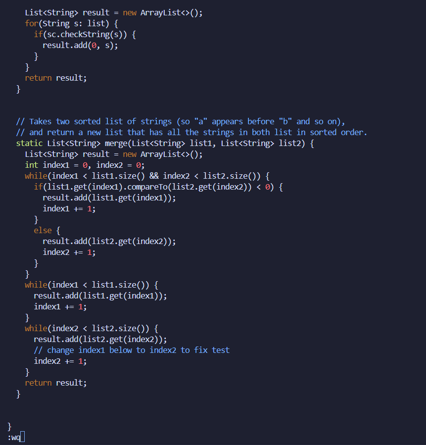
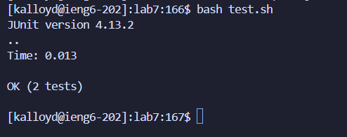
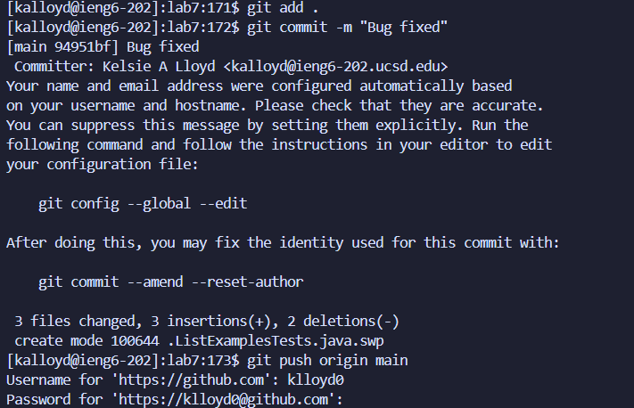
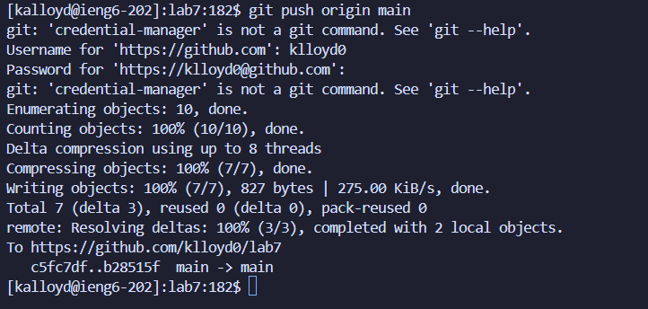

# Lab Report 4

* Keys pressed: `<up> <up> <up> <up> <enter>`
* The `ssh kalloyd@ieng6.ucsd.edu` command was four up in my search history, so that's all I needed to press to log into my ieng6 account.

* Keys pressed: `git <space> clone <space> <ctrl> v <enter>`
* All of these key presses were done to run the `git clone` command to clone my fork repo specific to my Github account, hence the `ctrl` and `v` key presses so I could directly paste the `https://github.com/klloyd0/lab7` link.

* Keys pressed: `cd <space> lab7 <enter> ls <enter> bash <space> te <tab> <enter>`
* The `cd` command was ran to ensure I'd be in the `lab7` directory. From there, `ls` was ran to ensure I'd find the specific file I wanted to run. Finally, the `bash test.sh` command was run to confirm that the tests failed as instructed.

* Keys pressed: `vim <space> Li <tab> .java <enter> jlxi2 <esc> :wq <enter>`
* Since `ListExamples.java` was already a relevant file, I pressed tab directly after typing `vim` and the first two characters of the file. However, since `.java` was not included after `<tab>`, I needed to manually type those keys in. Once I ran the `vim` command so I could edit the file, I pressed the `j` key 43 times to move downwards within the `FileExamples.java` file and then pressed the `l` key 13 times to move to the right until I reached the character that needed to be edited. From there, I pressed the `x` key to delete the `1` in the original `index1` variable. Then, I pressed `i` so I could enter the insert mode per vim commands and pressed `2` so the variable now reads as `index2`, therefore fixing the error. Finally, I hit `<esc>` to return to viewing mode and then ran the vim command `:wq` to save and exit the file.

* Keys pressed: `<up> <up> <enter>`
* Since I already had the `bash test.sh` command nearby in my search history, I only needed to press the up key two times to run the tests and confirm the failing test had been fixed and finally passed as needed.

* Keys pressed: `git <space> add <space> . <enter> git <space> commit <space> -m <space> "Bugs <space> fixed" <enter> git <space> push <space> origin <space> main <enter> klloyd0 <enter> <ctrl> v <enter>`
* In order to commit and push the changes, first I needed to run the `git add .` command. Once that successfully ran, I needed to run the `git commit -m` command in order to commit the changes onto my Github account, to which I added my own message with a simple `"Bugs fixed"`. Finally, I ran the `git push origin main` command so I could actually have the changes appear on my account. The commands then asked me for my username, to which I typed `klloyd0` and then asked for my password, to which I pressed `<ctrl>` and `v` to paste the personal access token needed to complete the push. I should note I had to go back and create a new token for this report since I forgot what my original key was. However, the command still ran as it needed to once I had my new key.
