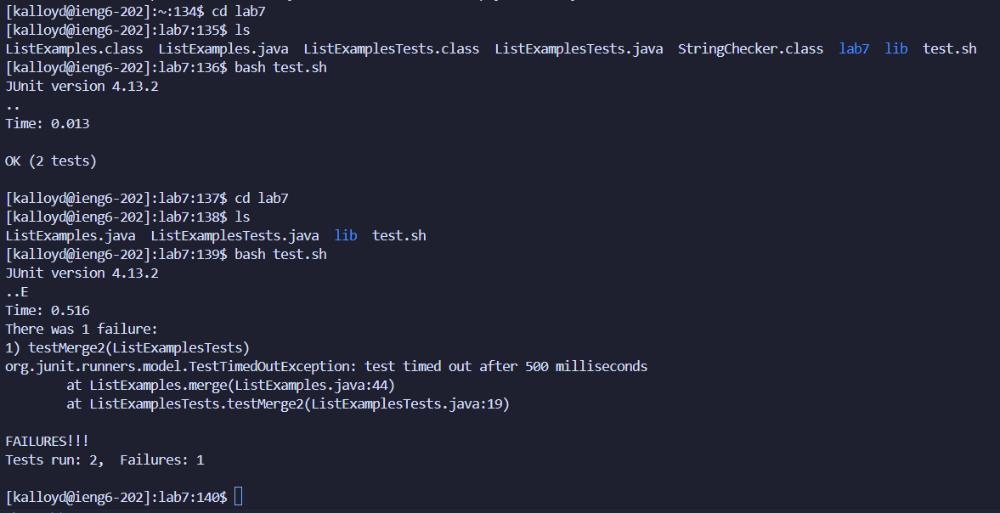

* Keys pressed: `<up> <up> <up> <up> <enter>`

* Keys pressed: `git <space> clone <space> <ctrl> v <enter>`

* Keys pressed: `cd <space> lab7 <enter> ls <enter> bash <space> te <tab> <enter>`

* Keys pressed: `vim <space> Li <tab> .java <enter> jlxi2 <esc> :wq <enter>`
* 43 j keys, 13 l keys

* Keys pressed: `<up> <up> <enter>`

* Keys pressed: `git <space> add <space> . <enter> git <space> -m <space> "Bug <space> fixed" <enter> git <space> push <space> origin <space> main <enter> klloyd0 <enter> <ctrl> v <enter>`
