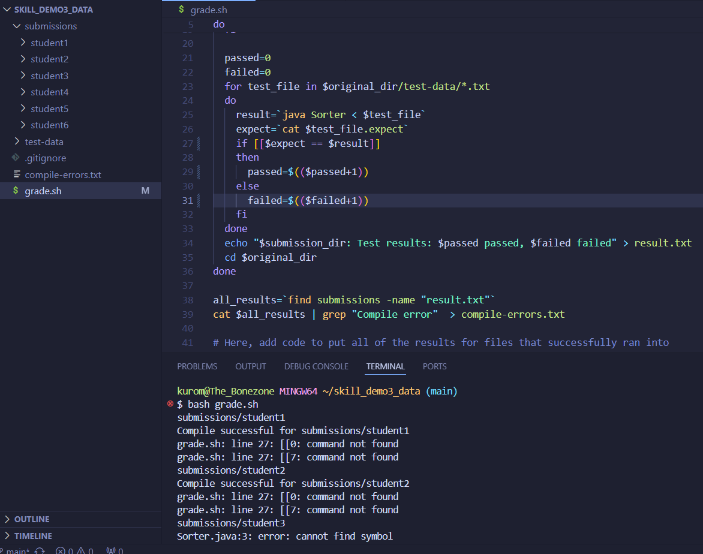
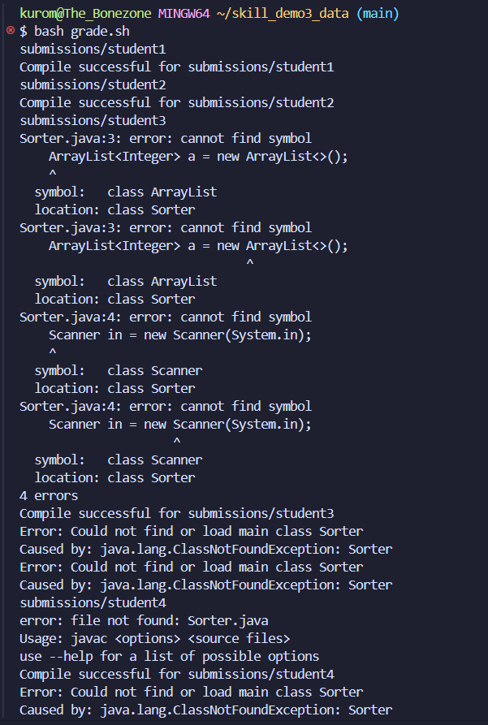

# Lab Report 5
## Part 1
## Question From Shaggy

Hello! I'm writing up my bash script for autograding the student submissions. I can see the bug has to do with a command not being found on line 27, but I'm still lost on which command might be the problem.

## Scooby's Answer

Notice you have have a conditional statement on line 27. I would suggest you review how conditionals are written in bash. They differ quite a bit from how they're written in Java, so I would pay close attention to not just syntax but also the format, including spacing.

## Output with Bug Fixed

The bug was merely a simple error in spacing within bash conditonals. Bash conditionals are written differently than Java conditionals in which everything is basically a terminal command. All instances of `$` in front of variables are seen as paths. Therefore, if they're not spaced, they'll be interpreted as a different command altogether, and an invalid one at that. Since the spacing was fixed, now all the tests run as they need to and can correctly determine which pass the autograder and which don't.

## Setup
* All of the student tests are in their own directory under `submissions` such that the `grade.sh` bash script runs commands to change directory into that specific one. Aside from that, both the file and the directory should be placed under the same parent directory together.
* All of the files stayed the same aside from `grade.sh`. Each version of `Sorter.java` in each individual student directory had different implementations, regardless of whether or not it was correct. The `grade.sh` file contained terminal commands to run an autograder on each version of `Sorter.java` and count how many passed and how many failed, all of which just happened to include the incorrect spacing on the conditional statements.
* The only command that was needed to trigger the bug (since `pwd` already has us in the working directory) was `bash grade.sh`.
* As stated above, the bug was merely an error in spacing and format for bash conditional statements. This was a pretty easy fix since all that's needed to rectify the problem is adding a space between the beginning parenthesis and `$` and then another space between the last character of the variable and the ending parathesis.

## Part 2

The second half of the quarter really introduced me to vim, which basically is a more direct way of accessing files within the terminal. Using various commands, one could not only open and read files within the terminal seconds after using the standard `cd` command as opposed to taking the time to open files on VSCode, but one also could edit them using commands such as the `i` insert command, alongside making a new file altogether.
